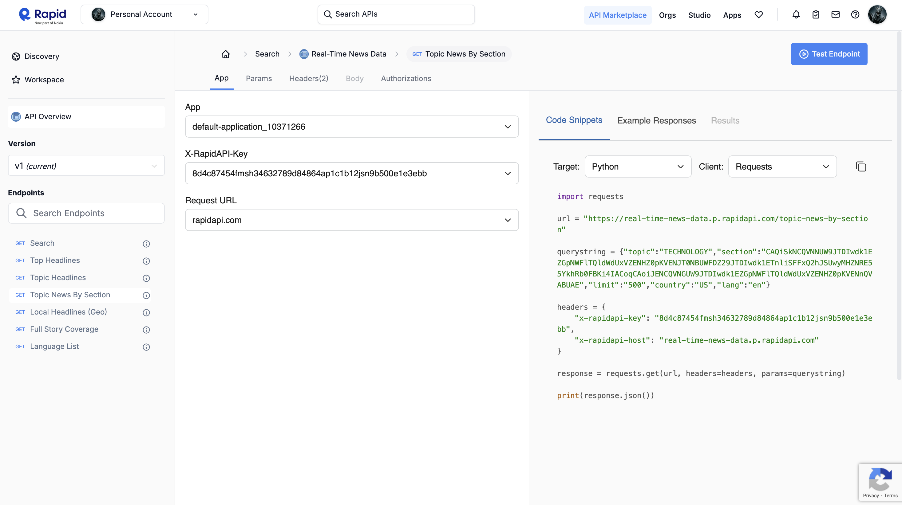
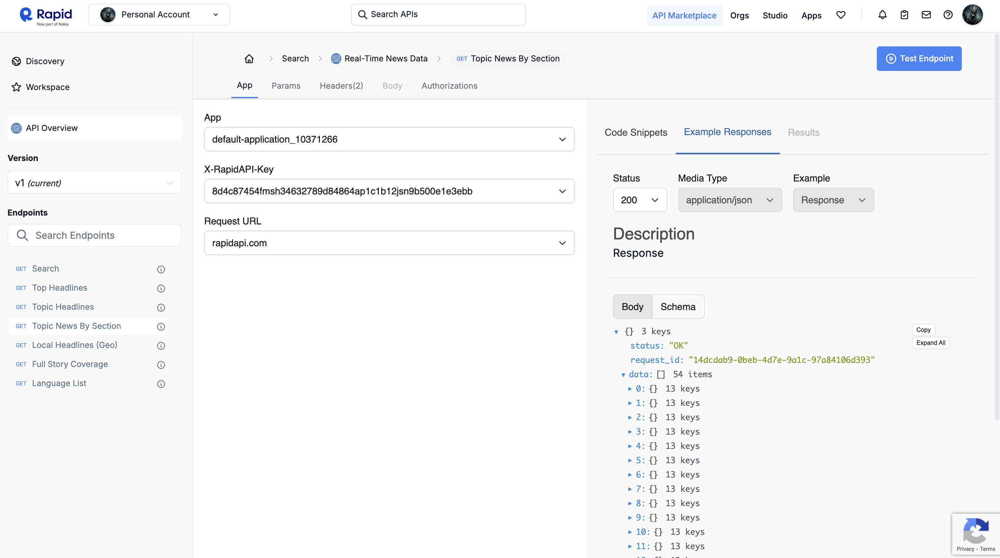
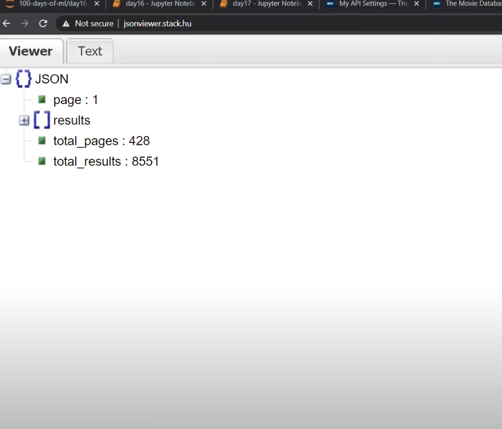
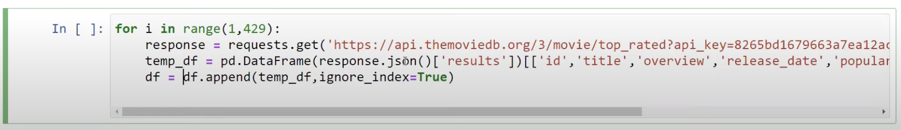
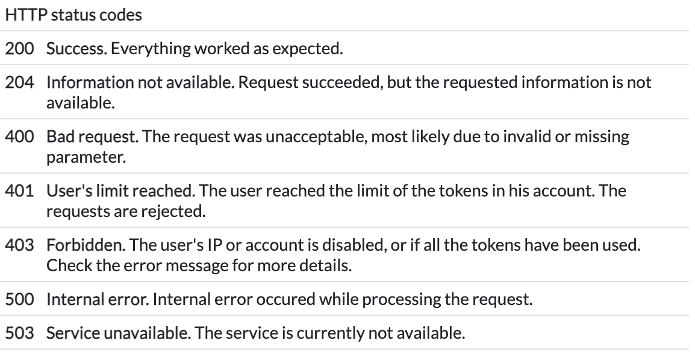

## SL-2

All About Machine Learning
REFER: https://youtube.com/playlist?list=PLeo1K3hjS3uvCeTYTeyfe0-rN5r8zn9rw&si=0-wTWXOgsey9Ht_e

<hr>

### Extra Learning 


<p><b> 1. How to make the dataset/dataframe from the API:</b> (refer: https://youtu.be/roTZJaxjnJc?si=23Z_jSg_6za7O1fV ) </p>

<p>Using the data from Rapid API website. <b>( Use its python code snippets and it not subscribed then subscribe it)</b></p>



<b>this is where we come to know where the data is in API:</b>



In the data have data in different pages then we have to use the loop

<b>Data: </b>

<b>Code:   (here, we will change the page number in loop and append the data in dataframe)</b>

<b>We can convert the data to csv file too</b>


```bash
    df.to_csv('top_news.csv')
```

<h4>This dataset can be aploaded on kaggle. (which can boost your kaggle profile)</h4>


Note: 




<h4><b>In real_time_fetch.ipnyb: we fetch the data from the real time api (https://newsdata.io/api-key) And in code if there is new news formed we add it to csv file <br> but if there is no new news then we don't add the news repeatedly.</b></h4>

<p>But this can cause the big size csv file, so we should have to use the online data.</p>